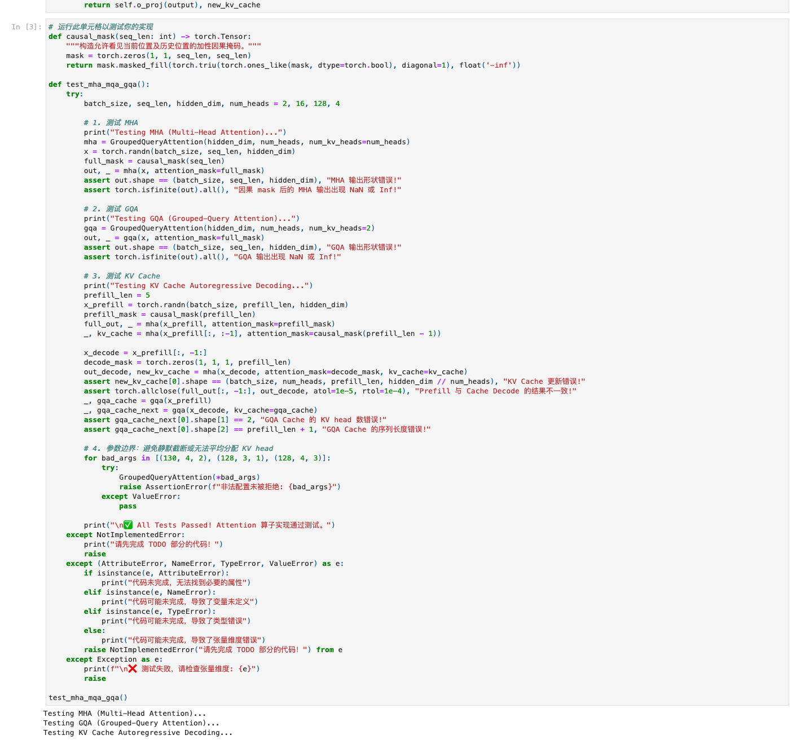
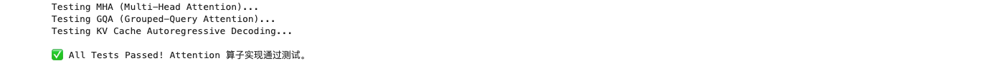

# Task0：请求结构与指标

- 打卡 Issue：[datawhalechina/llm-algo-leetcode#146](https://github.com/datawhalechina/llm-algo-leetcode/issues/146)
- 对应 Notebook：[`02_PyTorch_Algorithms/04_Attention_MHA_GQA.ipynb`](../../../02_PyTorch_Algorithms/04_Attention_MHA_GQA.ipynb)
- 执行环境：macOS arm64、Python 3.10.21、PyTorch 2.14.0、CPU
- 验证范围：MHA、GQA、KV Cache 增量解码、非法 head 配置

复现命令：

```bash
conda activate llm_algo
python tools/test_notebook_answers.py 02_PyTorch_Algorithms/04_Attention_MHA_GQA.ipynb --mode both
```

## 1. Attention 与 Transformer 的关系

Attention 是 Transformer 中负责“按当前 Query 从上下文中选择和聚合信息”的核心算子，但 Attention 不等于整个 Transformer。一个典型 Transformer Block 还包括归一化、残差连接、前馈网络，以及用于表达 token 位置的编码方式（例如 RoPE）。

在自回归推理中，当前 token 生成 Query，历史 token 提供 Key 和 Value。Attention 先计算 Query 与 Key 的匹配分数，再经过 Softmax 得到权重，最后对 Value 做加权求和。因果 Mask 保证当前位置不能看到未来 token。

## 2. MHA、GQA、MQA 与 MLA

假设 Query head 数为 `H`，KV head 数为 `H_kv`：

- MHA：`H_kv = H`。每个 Query head 都有独立的 K/V head，表达能力直接，但 KV Cache 最大。
- GQA：`1 < H_kv < H`。一组 Query head 共享一组 K/V；计算 Attention 前可以扩展 KV head 与 Query 对齐，但 Cache 里只保存未扩展的 KV，所以缓存量相对 MHA 约缩小到 `H_kv / H`。
- MQA：`H_kv = 1`。所有 Query head 共享一组 K/V，缓存最小，但共享更强，可能带来质量或实现层面的取舍。
- MLA：不是简单减少 KV head，而是把 K/V 相关状态压缩到低维潜在表示，并在计算时按模型结构需要恢复或吸收投影。它改变的是缓存表示与计算路径，不能只用 `H_kv` 的头数关系概括。

单层 KV Cache 的元素数量可以近似写成：

```text
2 × batch × sequence_length × H_kv × head_dim
```

其中 `2` 代表 K 和 V。再乘元素字节数与网络层数，才是模型整体的 KV Cache 规模。

## 3. 一次请求中的 Prefill 与 Decode

1. 请求进入服务后，可能先排队、分词和组 batch。
2. Prefill 一次处理 prompt 的全部 token，计算 Attention 并建立初始 KV Cache。序列维可以并行，通常更像矩阵乘矩阵。
3. Decode 每轮生成一个或少量新 token，读取历史 KV Cache，再把本轮的新 K/V 追加进去。不同生成步之间存在自回归依赖，所以时间维不能完全并行。
4. 生成结束后进行反分词、流式返回与资源释放。

## 4. TTFT 与 TPOT

- TTFT（Time To First Token）：请求到达后直到第一个输出 token 可用的时间。它会受到排队、调度、Prefill 和首次采样影响。
- TPOT（Time Per Output Token）：首 token 之后，平均生成一个输出 token 的时间，主要观察 Decode 阶段。

只看总耗时会混淆 prompt 处理和逐 token 生成。TTFT 更适合观察“多久开始响应”，TPOT 更适合观察“开始后输出是否流畅”。

## 5. 用 Roofline 理解两个阶段

Roofline 的关键量是算术强度：

```text
Arithmetic Intensity = FLOPs / 搬运字节数
```

Prefill 同时处理多个 prompt token，对权重和数据有更多复用机会，算术强度较高，更容易靠近 compute-bound。Decode 在小 batch 下每步只处理很少 token，却仍需读取大量权重和不断增长的 KV Cache，算术强度较低，往往更接近 memory-bandwidth-bound。

因此两阶段的优化重点不同：Prefill 更关注高效 Attention kernel、tiling 和减少中间矩阵；Decode 更关注 KV Cache 布局、量化、连续批处理和调度。

## 6. 实现与验证结果

题目区完成了四步：

1. 把 Q/K/V 从 `[B,S,*]` 重排为多头格式。
2. 在序列维 `dim=2` 拼接未扩展的历史 K/V。
3. 计算缩放点积、Mask、Softmax 与 Value 聚合。
4. 合并多头并通过输出投影。

验证覆盖：

- MHA 与 GQA 输出 shape 正确且没有 NaN/Inf。
- 单步 KV Cache Decode 与完整 Prefill 的末 token 输出数值一致。
- GQA Cache 始终保留原始 `H_kv`，没有因为计算前的 `repeat_kv` 被放大。
- 不能整除的 head 配置会被拒绝。

Notebook 测试单元与实际输出：



测试结果特写：



## 7. 后续深入实验

- 固定 `H=8`，比较 `H_kv=8/4/2/1` 时的 Cache 元素数量和 CPU 延迟。
- 改变 prompt 长度，分别测量 Prefill 与单步 Decode 时间，观察算术强度差异的外在表现。
- 故意缓存 `repeat_kv` 之后的张量，量化它相对正确 GQA Cache 多占多少内存。
- 比较 MHA、GQA、MQA 在同一随机初始化下不是数值等价关系，理解“共享 KV”是模型架构选择而不是无损运行时替换。
