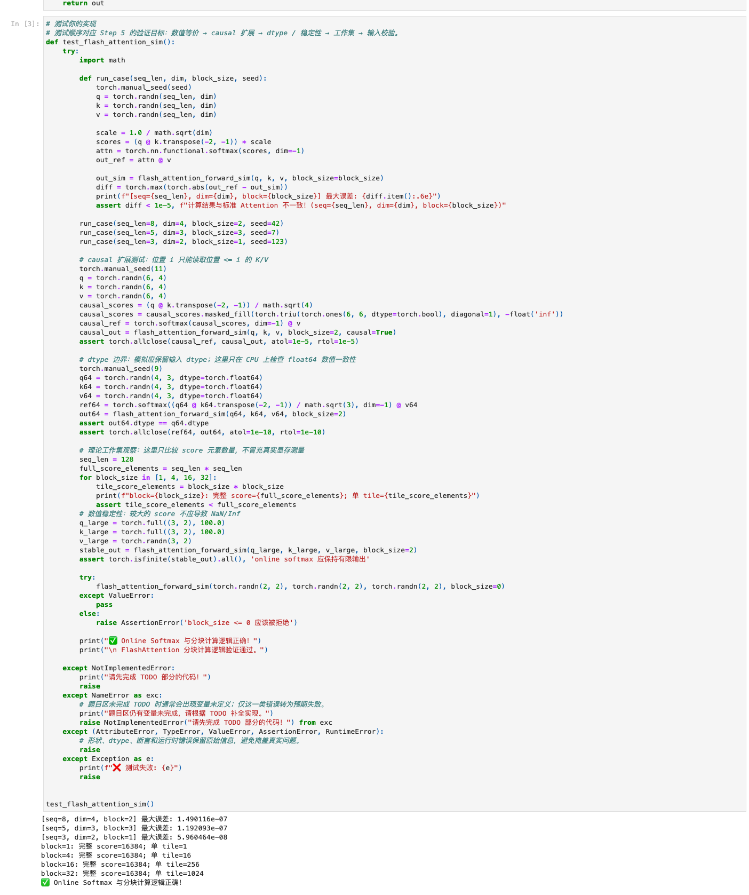
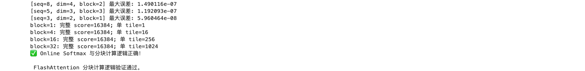

# Task1：Prefill 与 Attention Kernel

- 学习者：GitHub `zcloveyou2333` / 微信群 `zc_loveyou`
- 打卡任务：[llm-algo-leetcode 推理优化 | 202609 Task1 · Prefill 与 Attention Kernel](https://github.com/datawhalechina/llm-algo-leetcode/issues/147)
- 截止时间：2026-09-16 12:00
- 本次范围：完成最低要求 4.1；4.2、4.3 留作后续深入实验
- 运行环境：macOS，Python 3.10.21，PyTorch 2.14.0，CPU

## 我对 FlashAttention 的理解

标准 Attention 会先算出完整的 `N x N` score，再生成同样规模的 softmax 概率。这里的核心问题不仅是算术量，而是这些中间张量需要反复写入、读取显存（HBM）。序列长度增加时，中间矩阵按 `O(N²)` 增长，数据搬运和容量很快成为瓶颈。

FlashAttention 是精确 Attention 的 IO-aware 实现，不是近似算法。它把 Q、K、V 切成能放入片上存储的小块，融合 score、softmax 和对 V 的加权求和，不把完整的 score/概率矩阵落到 HBM。这样没有消除 Attention 的全部计算量，但显著减少了慢速层级之间的数据搬运，并把临时工作集限制在分块大小附近。

### HBM 与 SRAM 分别做什么

- HBM 是容量更大、位于芯片外的显存，保存完整 Q/K/V、输入和最终输出；带宽虽然高，但相对片上存储仍更慢、更昂贵。
- SRAM 是片上高速存储的统称。实际 GPU kernel 会组合使用 shared memory 和寄存器，它们不能被简单地完全等同为同一个东西。分块计算把当前 Q/K/V tile 和 softmax 状态放在这些小而快的层级中复用。

### Tiling 与 Online Softmax

对每个 Q tile，依次加载 K/V tile，计算当前 score tile。因为每次只看到了部分 key，softmax 不能直接一次归一化，需要为每一行维护三个状态：当前最大值 `m`、指数和 `l`、尚未或已经归一化的输出累积量 `O`。

合并一个新 score block 时：

```text
m_new = max(m_old, max(score_block))
l_new = exp(m_old - m_new) * l_old
        + sum(exp(score_block - m_new))
```

当最大值变化，旧的指数和与旧输出都必须乘上 `exp(m_old - m_new)`，再合并当前 block 的 `exp_scores @ V`。这就是在不保存完整 score 的前提下，仍得到与全量 stable softmax 一致结果的关键。

## 实现与真实验证

我补全并执行了 [20_FlashAttention_Sim.ipynb](../../../02_PyTorch_Algorithms/20_FlashAttention_Sim.ipynb) 的题目区，包括分块 score、causal mask、online max / sum、旧状态重标定和输出写回。也执行了 [14_FlashAttention_Memory_Model.ipynb](../../../01_Hardware_Math_and_Systems/14_FlashAttention_Memory_Model.ipynb) 的内存模型实验。

复现命令：

```bash
conda run --no-capture-output -n llm_algo \
  python tools/test_notebook_answers.py \
  02_PyTorch_Algorithms/20_FlashAttention_Sim.ipynb --mode both
```

题目区与答案区均通过。题目区三个等价性用例相对标准 Attention 的最大绝对误差分别为：

| seq / dim / block | 最大绝对误差 |
| --- | ---: |
| 8 / 4 / 2 | `1.490116e-07` |
| 5 / 3 / 3 | `1.192093e-07` |
| 3 / 2 / 1 | `5.960464e-08` |

此外通过了 causal、float64、较大 score 数值稳定性、非法 block size 和分块工作集检查。`seq_len=128` 时完整 score 有 16,384 个元素，而 block 为 1/4/16/32 时单个 score tile 分别只有 1/16/256/1,024 个元素。

Part01 在 `seq_len=4096, head_dim=128, fp16` 的估算中，tile 64/128/256 的 score tile 分别为 8/32/128 KB，工作集约为 72/160/384 KB；相对完整 score 的 score 元素缩减为 4096x/1024x/256x。这说明 tile 越大复用机会可能越多，但片上容量压力也越高。





## 这次结果不能说明什么

本次是在 CPU 上用 Python 循环模拟数据流，验证的是公式、数值等价性和工作集变化；它本身通常不会比 PyTorch 的标准实现快，也不能证明真实 GPU kernel 的加速比。当前没有做 CUDA、实际 HBM 流量或具体后端选择的实测，因此不把 CPU 结果描述成 GPU 性能结论。

## 后续深入实验清单

1. 扫描不同 `block_size`，比较误差、CPU 时间与临时工作集，理解分块粒度的权衡。
2. 根据序列长度和 tile 大小推导并核对 HBM 读写量，而不只比较中间张量元素数。
3. 有 CUDA 环境后，对比 naive Attention、PyTorch SDPA 的不同 backend，并记录显存峰值和延迟。
4. 查询实际 GPU 的 shared-memory / register 限制，解释 tile 大小、occupancy 与 kernel 配置的关系。
5. 继续梳理 FlashAttention 1/2/3/4 的演进，再连接到 Chunked Prefill 与 Prefix Cache 的服务调度问题。
