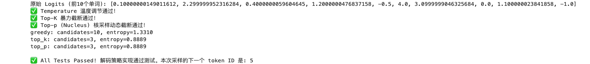

# Task2：单请求 Decode 与生成策略

- 学习者：GitHub `zcloveyou2333` / 微信群 `zc_loveyou`
- 打卡任务：[llm-algo-leetcode 推理优化 | 202609 Task2 · 单请求 Decode 与生成策略](https://github.com/datawhalechina/llm-algo-leetcode/issues/165)
- 截止时间：2026-09-19 12:00
- 打卡范围：完成 4.1；4.2、4.3 作为后续深入实验
- 运行环境：macOS，Python 3.10.21，PyTorch 2.14.0，CPU
- 教程来源：[Datawhale 社区](https://github.com/datawhalechina)的 [llm-algo-leetcode](https://github.com/datawhalechina/llm-algo-leetcode)

## 1. KV Cache 的近似账本

对一批长度相同的序列，KV Cache 的理论字节数可以近似写成：

```text
KV bytes ≈ 2 × num_layers × batch_size × seq_len
           × num_kv_heads × head_dim × bytes_per_element
```

开头的 `2` 分别对应 Key 和 Value。服务系统里各请求长度不同时，更准确的写法是：

```text
KV bytes ≈ 2 × num_layers × num_kv_heads × head_dim
           × bytes_per_element × Σ(active sequence lengths)
```

因此它对层数、活跃序列数、每条序列长度、KV head 数、head dimension 和 dtype 字节数近似线性。若有 `C` 个并发请求、每个请求又含 `B` 条序列且长度均为 `S`，账本中可出现 `C × B × S`；实际在线服务中“并发数”和“batch size”常常描述同一批活跃序列，不应无条件重复相乘。

KV Cache 不是 `O(S²)`，因为每个历史 token 在每层只保存一份 K 和一份 V；`S²` 是完整 Attention score 中每个 query-key 配对产生的中间规模。虽然单步 Decode 会读取不断增长的 KV Cache，累计计算代价仍可能很高，但缓存本身的容量对序列长度是一阶增长。

实际执行 [Part 01 · 11](../../../01_Hardware_Math_and_Systems/11_KV_Cache_and_Memory_Growth.ipynb) 的固定配置后：

| 配置变化 | 理论 KV Cache |
| --- | ---: |
| seq 1024 / MHA 32 KV heads | 0.54 GB |
| seq 2048 / MHA 32 KV heads | 1.07 GB |
| seq 4096 / MHA 32 KV heads | 2.15 GB |
| seq 4096 / GQA 8 KV heads | 0.54 GB |
| seq 4096 / MQA 1 KV head | 0.07 GB |

这组结果验证了序列长度和 KV head 数的线性关系；它是理论 tensor 账本，不包含 allocator、分页元数据、碎片、workspace 或框架保留显存。

## 2. KV Cache 压力可以从哪些层面优化

优化方法要先说清“减少的对象”，否则容易把逻辑缓存、显存驻留和计算复用混在一起。

| 层面与方法 | 主要减少什么 | 新增代价或边界 |
| --- | --- | --- |
| MQA / GQA | KV head 数与每 token 缓存元素 | 架构兼容、训练或微调要求，可能影响质量 |
| KV Cache 量化 | 每个缓存元素的字节数 | 量化误差、量化/反量化开销、kernel 支持 |
| MLA / latent KV | 每 token 的表示维度 | 架构与训练改动、重构计算和专用 kernel |
| PagedAttention | 预留浪费与外部碎片，不减少逻辑 KV 内容 | 页表元数据、地址间接访问、块管理复杂度 |
| Prefix Cache | 重复前缀的 Prefill 计算和重复构建 | 仍需保存可复用 KV；命中率、淘汰、隔离与一致性问题 |
| Sliding window / 截断 / 摘要 | 实际保留的历史 token 数 | 丢失远程上下文，可能降低任务质量 |
| Offload / swap / 重计算 | GPU 上的常驻 KV 容量 | PCIe/NVLink 搬运、重算开销与尾延迟 |
| 调度、连续批处理、准入控制 | 同时活跃或驻留的请求状态 | 排队时间与利用率之间的权衡，可能增加 TTFT |

本次分页小实验得到 4096 token、page size 128 时需要 32 页且尾页浪费为 0。它只验证分配粒度，不等价于真实 PagedAttention backend 的显存或吞吐收益。

## 3. Greedy、Temperature、Top-k、Top-p 改变了什么

- **Greedy**：直接选最大 logit 的 token，改变的是最终选择规则；给定相同状态时结果确定，但容易重复或陷入局部高概率模式。
- **Temperature**：在 Softmax 前使用 `logits / T`，改变概率分布的尖锐程度，不改变 token 排名。提高 `T` 会让分布更平，低概率候选更容易被抽到，因此多样性上升，同时错误、跳题和跨次运行波动也可能增加。
- **Top-k**：只保留分数最高的固定 `k` 个候选，再归一化采样；它改变候选集合的数量。
- **Top-p**：保留累计概率首次达到 `p` 的最小候选集合；它改变候选集合所覆盖的概率质量，因此候选数会随分布动态变化。

实际系统常将 Temperature、Top-k、Top-p 串联后再采样；组合顺序会影响最终候选集合。Temperature 很小仍是 sampling，不等于 Greedy。

我补全并执行了 [Part 02 · 21](../../../02_PyTorch_Algorithms/21_Decoding_Strategies.ipynb) 的 temperature 校验、Top-k 阈值过滤和 Top-p 边界保留。测试还覆盖非法参数、ties、batch 形状、随机种子和最小自回归循环。实际输出中：

| 策略观察 | 候选数 | 熵 |
| --- | ---: | ---: |
| greedy 观察基线（未截断分布） | 10 | 1.3310 |
| top-k=3 | 3 | 0.8889 |
| top-p=0.8 | 3 | 0.8889 |

这里的熵和候选数只说明合成 logits 上的分布变化，不代表真实模型生成质量。



## 4. 如何理解投机解码

普通自回归 Decode 通常每轮让目标模型生成一个 token。投机解码先让更便宜的**草稿模型**快速提出连续 `K` 个候选及其分布 `q`，再让高质量的**目标模型**一次计算对应位置的分布 `p` 并集中验证。目标模型仍是最终裁判，草稿模型只负责提案。

逐位置的接受概率是 `min(1, p(x) / q(x))`。候选被拒绝时，从 `max(p - q, 0)` 归一化后的 residual distribution 采样修正 token 并结束本轮；若全部 `K` 个候选都接受，再从目标模型额外位置采样一个 bonus token。在理想实现中，这套接受/修正规则保持目标分布，而一次目标 forward 有机会推进多个 token。

它不是免费加速：收益取决于草稿成本、接受率、验证并行度和系统实现。草稿模型与目标模型差距过大时，低接受率和额外草稿计算可能抵消收益；还会增加模型驻留、KV 状态同步和回滚控制流的复杂度。

我补全并执行了 [Part 02 · 23](../../../02_PyTorch_Algorithms/23_Speculative_Decoding.ipynb)，实际测试通过概率输入检查、接受分支、首个拒绝、residual correction、`q=0` 边界和全部接受后的 bonus token：


## 5. 复现与证据边界

```bash
conda run --no-capture-output -n llm_algo \
  python tools/test_notebook_answers.py \
  02_PyTorch_Algorithms/21_Decoding_Strategies.ipynb --mode both

conda run --no-capture-output -n llm_algo \
  python tools/test_notebook_answers.py \
  02_PyTorch_Algorithms/23_Speculative_Decoding.ipynb --mode both
```

两个 notebook 的题目区和答案区均通过。完整执行三份指定 notebook 也成功。本次使用合成概率与 CPU 控制流，能验证选择规则、概率修正和状态推进；不能证明真实模型质量、接受率、目标模型 forward 次数或 GPU 加速。

## 后续深入实验清单

1. 扫描 MHA/GQA/MQA、上下文长度、并发数和 KV dtype，生成理论账本与实际峰值显存的误差表。
2. 用同一批 prompts 对比 Greedy、Temperature、Top-k、Top-p 的重复率、长度、词汇多样性和人工质量评分。
3. 人为控制草稿分布与目标分布的距离，扫描接受率、每轮推进 token 数和投机解码盈亏平衡点。
4. 学习多 Token 解码，比较它与投机解码在候选生成、目标验证和状态更新上的差异。
5. 有匹配 GPU/backend 后记录 TTFT、TPOT、端到端延迟、吞吐、峰值显存和目标模型 forward 次数。
