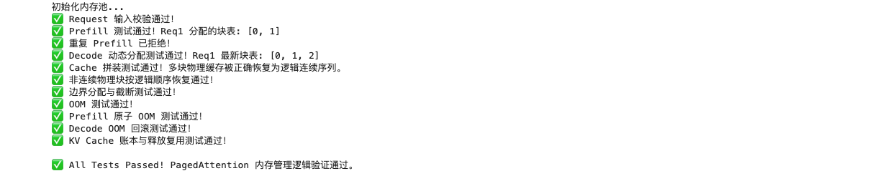

# Task3：KV Cache 状态与生命周期

- 学习者：GitHub `zcloveyou2333` / 微信群 `zc_loveyou`
- 打卡任务：[llm-algo-leetcode 推理优化 | 202609 Task3 · KV Cache 状态与生命周期](https://github.com/datawhalechina/llm-algo-leetcode/issues/166)
- 截止时间：2026-09-22 12:00
- 打卡范围：完成 4.1；4.2、4.3 作为后续深入实验
- 运行环境：macOS，Python 3.10.21，PyTorch 2.14.0，CPU
- 教程来源：[Datawhale 社区](https://github.com/datawhalechina)的 [llm-algo-leetcode](https://github.com/datawhalechina/llm-algo-leetcode)

## 1. PagedAttention 为什么把连续 KV Cache 拆成固定 Block

请求长度在进入服务时通常未知，而且请求会在不同时间开始、增长和结束。若为每个请求按最大长度申请一段连续 KV Cache，会产生三类问题：

1. **过度预留**：短请求也占用最大长度的空间。
2. **外部碎片**：请求释放后留下大小不同的空洞，剩余总空间足够也未必能找到一段足够大的连续区域。
3. **扩容与搬迁困难**：Decode 不断增长，连续区域末尾不一定还有空间。

PagedAttention 把物理池切成统一大小的 Block，Prefill 按需申请若干块，Decode 只有跨过块边界时才再申请一块，请求结束后将块归还空闲池。这样大块连续分配变成小粒度块分配，物理空洞能被其他请求重新使用，扩容也不要求搬迁旧 Cache。

分页并非消灭所有浪费：最后一个 Block 仍可能存在最多 `block_size - 1` 个 token 槽位的内部碎片，并新增 Block Table、分配器元数据和间接寻址成本。

### 逻辑位置、物理 Block 与 Block Table

假设每块容纳 `B` 个 token，请求内逻辑位置 `t` 可拆为：

```text
logical_block = floor(t / B)
offset_in_block = t mod B
physical_block = block_table[logical_block]
physical_location = physical_pool[physical_block, offset_in_block]
```

`block_table[i]` 表示请求的第 `i` 个逻辑 Block 映射到哪个物理 Block。Attention 按逻辑 token 顺序读取时，只需按表逐块访问；例如块表 `[3, 1]` 仍表示“先读物理块 3，再读物理块 1”。因此逻辑序列连续依赖的是映射顺序，不要求物理地址相邻。

我补全并执行了 [Part 02 · 22](../../../02_PyTorch_Algorithms/22_vLLM_PagedAttention.ipynb)，实现了容量账本、Prefill 分配、Decode 扩容、OOM 原子回滚、释放复用、占用报告以及按块表恢复逻辑 Cache。

实际测试中，`block_size=4`、prompt 长度 6 时块表为 `[0, 1]`；生成到长度 9 时扩为 `[0, 1, 2]`。另一个用例使用非连续块表 `[3, 1]`，仍按逻辑顺序恢复正确。容量用例得到单 token 1,024 bytes、4 个四-token Block 总计 16,384 bytes。



## 2. RadixAttention 如何组织与复用前缀

RadixAttention 将已经计算过的 token 前缀组织为压缩 Radix Tree：

- 每条边保存一段连续 token，而不是每个 token 一个节点。
- 多个请求的公共前缀只保留一条共享路径。
- 新路径与旧边部分重叠时，在最长公共前缀处把边分裂为 shared edge、旧后缀和新后缀。
- 终止节点表示一条完整登记路径；真实系统还会关联 KV Cache 句柄、引用计数和生命周期信息。

新请求到来时，从 prompt 的第一个 token 开始沿树逐边匹配。最长前缀匹配返回从开头连续命中的最大长度 `hit_len`：

```text
hit_prefix = prompt[:hit_len]    # 可直接复用
miss_suffix = prompt[hit_len:]   # 仍需 Prefill
```

因此最长前缀匹配不是为了找任意相似片段，而是把请求切成“已有 KV 状态”和“需要新增计算的后缀”。命中部分可以跳过重复 Prefill，后缀计算完成后再登记为新分支。真实复用还必须确保 token、位置编码、模型权重与配置兼容。

我补全并执行了 [Part 02 · 24](../../../02_PyTorch_Algorithms/24_SGLang_RadixAttention.ipynb)。测试覆盖 LCP、公共边合并、正向与反向边分裂、最长 terminal 命中、无命中、完整命中和空 prompt。对已登记 `[0,1,2,3]` 与 `[0,1,2,3,4]` 的树，请求 `[0,1,2,3,4,5]` 命中 5 个 token，只需继续计算后缀 `[5]`。


## 3. RadixAttention 与 PagedAttention 的区别

两者都接触 KV Cache，但解决的问题位于不同层：

| 角度 | PagedAttention | RadixAttention |
| --- | --- | --- |
| 核心问题 | KV Cache 如何分配、扩容、释放，减少预留与碎片 | 多请求间相同 token 前缀如何检索和复用 |
| 索引对象 | 逻辑 Block → 物理 Block | token 前缀 → 已缓存路径/Cache 句柄 |
| 没有重复前缀时 | 仍能改善内存分配与回收 | 基本没有 Prefill 复用收益 |
| 主要收益 | 更灵活的容量管理与更高内存利用率 | 跳过重复前缀计算，潜在降低 TTFT |
| 新增成本 | Block Table、分配器、间接寻址、尾块碎片 | 树索引、引用计数、命中校验、淘汰和一致性 |

它们可以组合而非互斥：Radix Tree 决定“哪些逻辑前缀可复用”，Paged Block Manager 决定“这些 KV Tensor 放在哪些物理块、如何共享和释放”。当多请求共享同一前缀 Block 时，还需要引用计数或类似机制，最后一个引用消失后才能回收。

## 4. 复现与证据边界

```bash
conda run --no-capture-output -n llm_algo \
  python tools/test_notebook_answers.py \
  02_PyTorch_Algorithms/22_vLLM_PagedAttention.ipynb --mode both

conda run --no-capture-output -n llm_algo \
  python tools/test_notebook_answers.py \
  02_PyTorch_Algorithms/24_SGLang_RadixAttention.ipynb --mode both
```

两个 notebook 的题目区与答案区均通过，并已从头到尾执行成功。可选 GPU 单元保持 `dry_run`：PagedAttention 的合成计划显示四个请求分页后分配 304 个 token 槽位，而统一连续预留为 1,024 个；这是配置与容量模型，不是实际 CUDA、vLLM 或 SGLang benchmark。

本次 CPU 结果能验证块表状态转换、逻辑映射、树结构和前缀拆分；不能据此声称真实 TTFT、吞吐、峰值显存或 P99 延迟改善。

## 后续深入实验清单

1. 扫描不同 `block_size` 和长度分布，比较尾块浪费、Block Table 大小、分配次数与理论利用率。
2. 把 Radix Tree 命中路径与物理 Block Table 连接起来，加入共享 Block 引用计数、Copy-on-Write 和安全释放。
3. 补完 KV Cache 生命周期状态机：创建、命中、增长、锁定、驱逐、offload、回收及其触发事件。
4. 对照 Prefix Cache 与 Chunked Prefill，测量复用 token 数、命中率、TTFT 改善、Decode 干扰和缓存维护成本。
5. 在真实 vLLM/SGLang GPU backend 上，用同一 workload 对比无缓存 baseline，并记录 TTFT、TPOT、吞吐、峰值显存和 P99。
