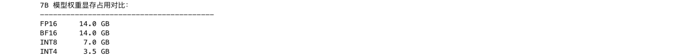

# Task5：量化部署与成本

- 学习者：GitHub `zcloveyou2333` / 微信群 `zc_loveyou`
- 打卡任务：[llm-algo-leetcode 推理优化 | 202609 Task5 · 量化部署与成本](https://github.com/datawhalechina/llm-algo-leetcode/issues/175)
- 截止时间：2026-09-28 12:00
- 打卡范围：完成 4.1；4.2、4.3 作为后续深入实验
- 运行环境：macOS，Python 3.10.21，PyTorch 2.14.0，CPU
- 教程来源：[Datawhale 社区](https://github.com/datawhalechina)的 [llm-algo-leetcode](https://github.com/datawhalechina/llm-algo-leetcode)

## 1. 权重、激活和 KV Cache 量化不是同一种优化

三者都把高精度数值映射到低比特表示，但它们作用的对象、生命周期、主要瓶颈和风险不同。

| 量化对象 | 主要解决的瓶颈 | 状态生命周期 | 首要风险与验证 |
| --- | --- | --- | --- |
| 权重 | 模型文件、权重显存和每次前向读取权重的 HBM 带宽 | 模型加载后长期不变，通常离线生成 artifact | 层输出/Logit/任务质量误差，artifact 与 kernel 是否兼容 |
| 激活 | 运行时中间张量的显存、带宽和低精度矩阵计算成本 | 随输入、token 和层动态变化 | outlier、动态范围漂移、scale 选择与累加稳定性 |
| KV Cache | 上下文长度和并发增长带来的常驻显存与反复读写带宽 | 每个请求在 Prefill/Decode 中持续创建、增长和释放 | 长上下文误差累积、Attention 质量、读写 kernel 与 cache 生命周期 |

因此不能只用“都是 INT8/FP8”归为同一优化：权重可以在部署前离线校准并封装，激活需要处理每次运行的动态分布，KV Cache 则是按请求增长的在线状态。三者需要不同的 scale 粒度、kernel、backend 接口、误差预算和生命周期管理。

我从头执行了 [Part 01 · 21](../../../01_Hardware_Math_and_Systems/21_Quantization_Theory_and_INT4_INT8.ipynb)。在不计 scale、zero-point 和 packing 元数据的理论账本中，7B 权重由 FP16 的 14GB 变为 INT8 的 7GB、INT4 的 3.5GB。



该 Notebook 的 CPU 随机张量实验还得到：8-bit MSE 为 `0.000348`、最大误差为 `0.032230`；4-bit MSE 为 `0.112438`、最大误差为 `0.585692`。这只说明同一玩具分布下降 bit 后数值误差变大，不代表真实模型的任务质量。

## 2. W8A16 为什么这样组织存储和计算

W8A16 的 `W8` 表示权重以 INT8 加 scale 的形式保存，主要节省长期驻留的权重显存和权重读取带宽；`A16` 表示输入激活通常仍以 FP16/BF16 进入计算路径。保留高精度激活的原因包括：

1. 激活分布随输入动态变化，包含 outlier，直接低比特化需要额外校准或动态 scale；
2. 保留 FP16/BF16 能避免同时引入权重误差和激活误差，部署与质量定位更简单；
3. backend 可以在读取 INT8 权重时融合反量化与矩阵乘法，而不要求上下游算子都改成 INT8 接口。

反量化发生在权重参加矩阵乘法之前，或者融合在 kernel 内部、权重从显存载入寄存器/片上存储时完成。教程实现采用：

```text
q = round(weight * scale)
weight_hat = q / scale
output = linear(activation_16, weight_hat_16, bias_16)
```

有些库把 scale 定义成相反方向，即 `q = round(weight / step)`、`weight_hat = q * step`；两种写法等价，但 artifact 和 kernel 必须使用同一约定。

我补全并执行了 [Part 02 · 25](../../../02_PyTorch_Algorithms/25_Quantization_W8A16.ipynb)：实现全零安全的 absmax 对称映射、INT8 clamp，以及按激活 dtype 反量化后调用 `F.linear`。测试覆盖量化边界、实际 INT8 buffer、显式参考路径、FP16 激活和集成前向。


## 3. GPTQ 与 AWQ 如何使用校准信息

GPTQ 和 AWQ 都属于 weight-only PTQ，但“哪些误差更值得避免”的判断依据不同：

- **GPTQ** 使用校准激活估计二阶信息，常以输入相关的近似 Hessian/协方差描述不同权重方向对层输出重构误差的敏感度；量化一部分权重后，再利用相关性补偿剩余权重。它更接近“在层输出重构目标下，把误差分配到代价较低的方向”。
- **AWQ** 观察校准激活的通道显著性。少量高激活通道会放大对应权重误差，因此优先保护或缩放这些 salient channels，再量化其余权重。它更接近“把有限高精度能力留给对真实激活最重要的通道”。

我补全并执行了 [Part 02 · 40](../../../02_PyTorch_Algorithms/40_GPTQ_and_AWQ_Weight_Quantization.ipynb)：实现激活 RMS 重要性、非整除 group、AWQ top-k 保护、安全 group scale 和反量化恢复。


这里的代码是教学模拟：AWQ 路径显式保护高重要性通道；GPTQ 路径验证分组量化和重构误差，但没有实现论文中的完整 Hessian 更新和逐列误差补偿。因此测试通过证明状态与不变量正确，不等于复现了生产 GPTQ/AWQ kernel。

## 4. 校准集不能代替质量评测集

校准数据用于估计 scale、clipping、通道重要性或二阶统计，相当于量化配置的“训练输入”。如果再用同一批样本宣称质量保持，会得到偏乐观结果，也无法证明方案能够泛化到不同主题、长度、语言和任务。

部署前应把证据分层记录：

- **数值误差**：权重 MSE、层输出 MSE/余弦相似度、Logit 差异或 KL、困惑度变化；
- **任务质量**：在与校准集隔离的 held-out 集上记录准确率、Exact Match、生成任务指标及领域关键用例；
- **稳定性切片**：短/长上下文、不同语言、包含 outlier 的输入、关键安全与格式遵循用例；
- **执行路径**：量化 artifact 的格式与哈希、bit、group size、scale 粒度、backend、实际命中的 kernel 和 fallback；
- **系统成本**：模型/峰值显存、加载时间、latency、throughput，以及与浮点 baseline 完全一致的 workload。

量化是否接受需要同时满足容量/性能收益和质量预算。校准误差下降只能说明量化参数更贴合校准样本，不能替代 held-out 任务结论。

## 5. 复现与证据边界

```bash
conda run --no-capture-output -n llm_algo \
  python tools/test_notebook_answers.py \
  02_PyTorch_Algorithms/25_Quantization_W8A16.ipynb --mode both

conda run --no-capture-output -n llm_algo \
  python tools/test_notebook_answers.py \
  02_PyTorch_Algorithms/40_GPTQ_and_AWQ_Weight_Quantization.ipynb --mode both
```

两份实现 Notebook 的题目区与答案区测试全部通过；Part 01 · 21 以及两份实现 Notebook 均从头到尾执行成功。实际 CPU 输出、执行序号和截图已经保存。

本机 `torch.cuda.is_available()` 为 `False`。W8A16 与 GPTQ/AWQ Notebook 只生成 `run_mode=dry_run`、`evidence_level=environment_preflight` 的真实环境记录，没有 GPU latency、throughput 或峰值显存数据，也没有下载模型或运行成熟量化 backend。对应记录位于：

- `02_PyTorch_Algorithms/benchmarks/results/25_w8a16_gpu.json`
- `02_PyTorch_Algorithms/benchmarks/results/40_gptq_awq_gpu.json`

## 后续深入实验清单

1. 对同一权重扫描 INT8/INT4、per-tensor/per-channel 和不同 group size，比较权重误差、层输出误差与元数据开销。
2. 建立互斥的 calibration / validation / task test 三份数据，检查校准样本规模和分布偏移对 held-out 质量的影响。
3. 在真实 GPU backend 上用同一模型和 workload 对比 FP16、W8A16、GPTQ 与 AWQ，记录 kernel 路径、峰值显存、latency、throughput 和任务质量。
4. 增加 FP8 计算与 KV Cache INT8/FP8 路径，扫描上下文长度和并发，观察 TTFT、TPOT、容量与长文本质量。
5. 建立 artifact × backend × GPU 架构兼容矩阵，明确原生 kernel、fallback、加载失败和不支持状态，避免“文件能加载”等同于“低比特路径生效”。
