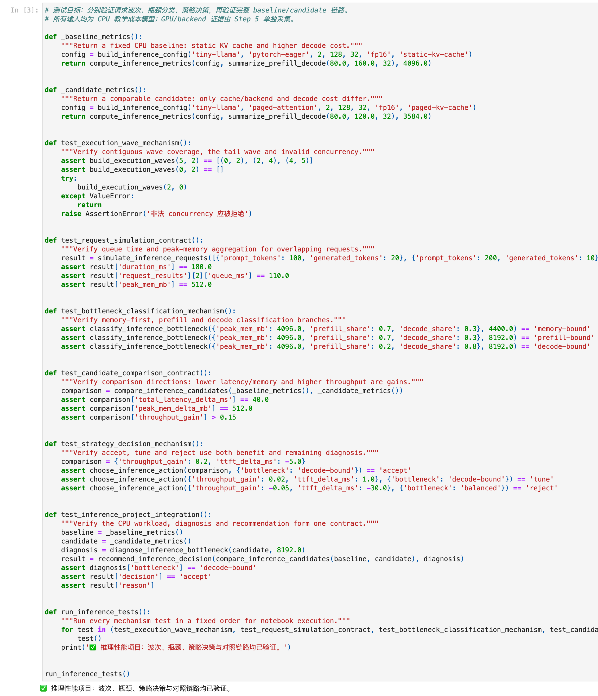
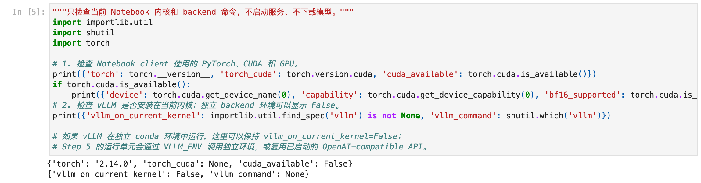

# Task6：推理优化学习总结与遗留问题

- 学习者：GitHub `zcloveyou2333` / 微信群 `zc_loveyou`
- 打卡任务：[llm-algo-leetcode 推理优化 | 202609 Task6 · 总结](https://github.com/datawhalechina/llm-algo-leetcode/issues/176)
- 官方截止时间：2026-09-30 12:00
- 打卡范围：完成 4.1、4.2、4.3、4.4；4.5 记入下一阶段路线
- 复查时间：2026-09-26
- 学习来源：[Datawhale 社区](https://github.com/datawhalechina)的 [llm-algo-leetcode](https://github.com/datawhalechina/llm-algo-leetcode)

## 1. Task0–5 作业复查

截至本次复查，仓库已经拉取最新上游；`main`、`origin/main` 和 `upstream/main` 都位于 `33ee80a`。Task0–5 的官方 Issue 评论全部存在，六次最小作业均已完成。本次又统一重跑了 11 份实现 Notebook 的题目区和答案区测试，结果全部通过。

| Task | 我真正掌握的主线 | 本次重新验证 | 已完成范围 | 仍需深入 |
| --- | --- | --- | --- | --- |
| [Task0](https://github.com/datawhalechina/llm-algo-leetcode/issues/146#issuecomment-5652628876) | 请求经过 Attention、Prefill、Decode，并由 TTFT/TPOT 观察 | `04_Attention_MHA_GQA` Question/Answer 通过 | 4.1 + 4.2 + 4.3 | MHA/GQA/MQA 的真实显存和 GPU 延迟对照 |
| [Task1](https://github.com/datawhalechina/llm-algo-leetcode/issues/147#issuecomment-5657673419) | FlashAttention 用 tiling、online softmax 和 kernel fusion 减少 HBM 往返 | `20_FlashAttention_Sim` Question/Answer 通过 | 4.1 | FlashAttention 1–4 与具体 GPU 架构、occupancy、带宽实测 |
| [Task2](https://github.com/datawhalechina/llm-algo-leetcode/issues/165#issuecomment-5730691811) | KV Cache 线性增长；采样改变分布；投机解码用便宜提案换目标模型并行验证 | `21_Decoding_Strategies`、`23_Speculative_Decoding` Question/Answer 通过 | 4.1 | 多 Token 解码、真实模型质量和投机解码盈亏平衡点 |
| [Task3](https://github.com/datawhalechina/llm-algo-leetcode/issues/166#issuecomment-5750104058) | PagedAttention 管分配，RadixAttention 管跨请求前缀复用 | `22_vLLM_PagedAttention`、`24_SGLang_RadixAttention` Question/Answer 通过 | 4.1 | 引用计数、Copy-on-Write、驱逐与真实 Prefix Cache 收益 |
| [Task4](https://github.com/datawhalechina/llm-algo-leetcode/issues/174#issuecomment-5837029861) | 请求选择、KV 准入、迭代级动态批次和 PD handoff 是不同调度层 | `36`、`37`、`38` 三份调度 Notebook Question/Answer 通过 | 4.1 | 将三个模拟器合并，并在真实 Serving 中验证 P95/P99 和公平性 |
| [Task5](https://github.com/datawhalechina/llm-algo-leetcode/issues/175#issuecomment-5842311886) | 权重、激活、KV 量化作用对象不同；artifact、backend、kernel、质量缺一不可 | `25_Quantization_W8A16`、`40_GPTQ_and_AWQ` Question/Answer 通过 | 4.1 | 真实量化模型的 held-out 质量与 GPU backend 对照 |

结论不是“所有推理优化都做完了”，而是：**Task0–5 的最小闭环已经完整，CPU 教学实现与状态不变量有证据；生产 GPU kernel、真实模型质量和在线 Serving 指标仍是明确的下一阶段。**

## 2. 我现在如何理解一条推理链路

```text
API 请求
  -> Tokenizer：文本与 token IDs 的边界
  -> Scheduler：排队、准入、动态 batch、Prefill/Decode 选择
  -> Model + Inference Engine：执行 Attention/MLP，管理 KV Cache 与 kernel
  -> GPU/CPU：提供算力、显存容量、内存带宽和互联
  -> Streaming API：逐 token 返回、结束、释放请求状态
```

这些对象不能混为一谈：

- **模型**定义权重、层数、Attention 结构、KV head 和上下文能力；量化 artifact 也是模型表示的一部分。
- **Tokenizer**决定文本如何变成 token。Prompt 长度、停止条件、前缀命中都必须以 token 序列为准。
- **推理框架**如 Transformers、vLLM、SGLang 负责加载模型并组织执行，但抽象层不同：Transformers 更接近模型调用基线，vLLM/SGLang 还提供面向多请求的缓存、调度和服务能力。
- **GPU**决定 kernel 是否可用、显存能容纳多少权重/KV/工作区，以及计算、带宽和互联的上限。
- **API 服务**加入排队、并发、超时、流式传输和失败恢复；离线单次 forward 快，不等于在线 P99 好。

指标也要绑定阶段：

| 指标 | 主要观察对象 | 容易混入的因素 |
| --- | --- | --- |
| TTFT | 排队 + 调度 + Tokenizer + Prefill + 首次采样 | Prompt 长度、并发、Chunked Prefill、冷启动 |
| TPOT | 首 token 后的 Decode 节奏 | KV 读取、权重带宽、动态 batch、调度抖动 |
| E2E latency | 用户从请求到完成的总等待 | TTFT、输出长度、TPOT、网络与重试 |
| Throughput | 单位时间完成的请求或输出 token | Batch/并发、输出长度、失败请求、测量窗口 |
| Peak memory | 权重、KV Cache、激活、workspace 与 allocator | dtype、上下文、并发、碎片与框架保留 |
| P95/P99 | 尾部请求体验 | 排队、长 Prefill、OOM/重试、资源争用 |

## 3. 六个 Task 串起来后的核心认识

### 3.1 先判断阶段，再选优化

Prefill 更容易受大矩阵计算和 Attention 中间数据搬运影响；Decode 有自回归依赖，每步读取权重与不断增长的 KV Cache，更容易受带宽、缓存容量和调度影响。没有阶段诊断就直接换 kernel、量化或加并发，可能只是把瓶颈移到别处。

### 3.2 “减少容量”“减少计算”“提高复用”“改变调度”是四类不同动作

- GQA、KV 量化减少每 token 的缓存账本。
- FlashAttention 减少中间矩阵的 HBM 流量，但不等于消除 Attention 计算。
- Prefix/Radix Cache 跳过重复前缀的 Prefill，但要付索引、驻留和驱逐成本。
- PagedAttention 改善分配和碎片，不减少逻辑 KV 内容。
- Chunked Prefill 和连续批处理改变工作如何交错执行，优化尾延迟与利用率的权衡。

### 3.3 机制正确不等于系统收益成立

我把证据分成四层：

1. **公式/状态不变量**：CPU 合成输入能验证算法控制流和账本。
2. **真实执行路径**：必须确认实际命中的 dtype、kernel、cache 与 fallback。
3. **统一 benchmark**：baseline/candidate 固定模型、请求集、长度、并发、warmup 和指标口径。
4. **质量与稳定性**：平均值之外还要看 held-out 任务质量、P95/P99、OOM 和失败状态。

当前 Task0–6 已扎实覆盖第 1 层，并为第 2–4 层建立了实验入口；它们不能被误写成 GPU 生产结论。

## 4. Part 02 · 66 推理性能项目

本次补全并从头执行了 [`66_Inference_Performance_Comparison.ipynb`](../../../02_PyTorch_Algorithms/66_Inference_Performance_Comparison.ipynb)：

1. 按 `concurrency` 把请求切成连续执行波次，保留尾部不足一整波的请求；
2. 先判断显存容量风险，再区分 prefill-bound、decode-bound 和 balanced；
3. 用吞吐收益、TTFT 退化预算和剩余瓶颈做 `accept / tune / reject` 决策。

题目区与答案区测试均通过，11 个代码单元全部执行且没有错误。实际环境预检输出为：



```text
torch=2.14.0
torch_cuda=None
cuda_available=False
vllm_on_current_kernel=False
vllm_command=None
```



因此本次能够证明 CPU 教学模型的波次、瓶颈、决策与对照链路正确；真实 vLLM 和 SGLang backend 被明确跳过，没有记录伪造的 TTFT、TPOT、吞吐或峰值显存。

## 5. 本月遗留问题与优先级

### P0：建立真实 GPU baseline

- 在同一张 GPU 上选一个小模型，固定模型 revision、Tokenizer、Prompt 集、输出长度、并发、warmup 和重复次数。
- 先跑 Transformers/eager 基线，再跑 vLLM G0；SGLang 只替换 backend，其余条件保持不变。
- 同时记录 TTFT、TPOT、E2E、throughput、peak memory、P95/P99、成功率和执行路径。

### P0：把单点机制连成请求级实验

- 将 Decode 请求选择、Paged KV 准入和 Chunked Prefill 合成同一迭代级模拟器。
- 加入 Prefix Cache 命中、引用计数、驱逐、抢占和失败回滚。
- 观察高吞吐配置是否牺牲短请求 TPOT 或长请求公平性。

### P1：补量化质量与 backend 证据

- 将 calibration、validation 和 task test 严格分开。
- 用同一模型对比 FP16、W8A16、GPTQ、AWQ，以及后续的 KV Cache 量化。
- 记录 artifact 哈希、bit/group size、真实 kernel、fallback、显存、性能和 held-out 质量。

### P1：连接算法与硬件

- 梳理 FlashAttention 1–4 对 GPU 架构、shared memory、register、tensor core 和异步搬运的要求。
- 用 profiler 核对 HBM 流量、occupancy 与 kernel 时间，不把 Python CPU 模拟当作硬件性能。

### P2：进入系统扩展主题

- 分布式推理：Tensor Parallel、Pipeline Parallel、Expert Parallel 与 KV/通信代价。
- 算子融合：RMSNorm、RoPE、Attention/MLP 融合及其数值与调试边界。
- 多模态推理：视觉 token 对 Prefill、KV Cache、batching 和显存账本的影响。

## 6. 下一轮实验顺序

1. 先租用或准备一张兼容 GPU，用 Part 02 · 66 完成 vLLM G0 smoke test 和正式 baseline。
2. 只改变一个变量建立 G1：优先选择并发或量化，不同时叠加多项优化。
3. 增加 SGLang backend 对照，并保留不支持、启动失败和 OOM 记录。
4. 在相同 workload 下补质量评测与长短请求切片，再决定 `accept / tune / reject`。
5. baseline 稳定后，再研究分布式、融合和多模态，避免同时扩大太多变量。

## 7. 复现命令与证据边界

Task0–5 的 11 份实现 Notebook 均使用以下形式重新验证：

```bash
conda run --no-capture-output -n llm_algo \
  python tools/test_notebook_answers.py <notebook> --mode both
```

Task6 的 Part 02 · 66 额外进行了完整执行：

```bash
conda run --no-capture-output -n llm_algo \
  python -m jupyter nbconvert --execute --to notebook --inplace \
  02_PyTorch_Algorithms/66_Inference_Performance_Comparison.ipynb
```

本机为 macOS CPU 环境。所有“通过”均对应真实执行的 CPU 结果；GPU、vLLM、SGLang 仍属于下一阶段，不把 `dry_run` 或环境预检描述成真实性能。
